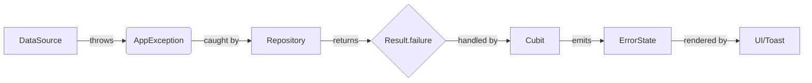
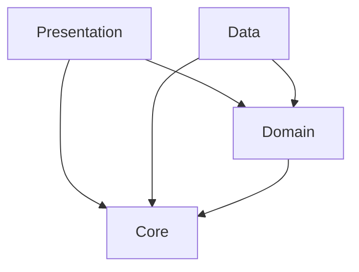
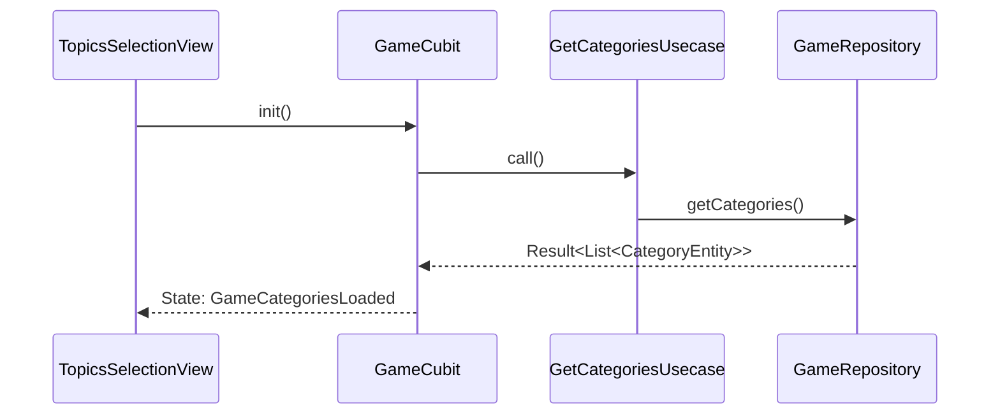

<!-- context-mode: coding -->
# CLAUDE.md — Imposter Project Standards

## Section A — General Engineering Rules
- **Architecture**: Strict Clean Architecture implementation. Layers: `Presentation` (UI/Cubit) → `Domain` (UseCases/Entities) ← `Data` (Models/Repos/Sources).
- **Separation of Concerns**: Core logic must be decoupled from Flutter framework where possible (Domain layer purity).
- **Shared Code**: All reusable UI, themes, and logic must reside in `lib/core/`.
- **Error Handling Strategy**:
  - Data sources throw `AppException`.
  - Repositories catch exceptions and return `FailureResult(Failure)`.
  - Cubits map Failures to UI messages.
- **Change Discipline**: Atomic commits. Smallest possible change per task. No unrelated refactoring.
- **Dependencies**: ⚠️ **NEVER add new packages to `pubspec.yaml` without explicit permission.**
- **Security**: Centralize sensitive metadata in `FeedbackConstants`. Avoid hardcoding API paths outside constants.
- **Testing**: Follow `very_good_analysis` lints. Unit tests required for UseCases and Cubits.

## Section B — Flutter/Dart Specific Rules
- **State Management**: `flutter_bloc` (Cubit). One Cubit per major feature/view.
- **Code Generation**: No `build_runner` dependencies currently. Manual `fromMap`/`toMap` is the project standard.
- **Domain Layer Purity**: Entities must NOT import `material.dart` or any data-layer model.
- **Feature Folder Structure**: 
  - `lib/features/{feature_name}/data/{datasources,models,repositories}`
  - `lib/features/{feature_name}/domain/{entities,repositories,usecases,services}`
  - `lib/features/{feature_name}/presentation/{cubit,views,widgets}`
- **Error Handling Contract**: Layers communicate via `Result<T>` sealed class.
- **Dependency Injection**: Use `sl<T>()` for all dependencies. 
- **Build Method Discipline**:
  - Always use `const` for immutable widgets.
  - Limit `BlocBuilder` scope to the smallest possible widget tree.
  - Use `unawaited()` for non-blocking async calls in `initState` or `onTap`.

## Section C — Naming Conventions

### Files & Directories
| Type | Pattern | Example |
| :--- | :--- | :--- |
| **Files** | `snake_case` | `game_local_data_source.dart` |
| **Directories** | `snake_case` | `presentation/widgets/` |

### Classes
| Type | Pattern | Example |
| :--- | :--- | :--- |
| **Widgets** | `PascalCase` | `AppButton`, `GameView` |
| **Cubits** | `PascalCase` + `Cubit` | `GameCubit` |
| **States** | `PascalCase` + `State` | `GameScanning` |
| **Entities** | `PascalCase` + `Entity` | `CategoryEntity` |
| **Models** | `PascalCase` + `Model` | `CategoryModel` |
| **Repositories** | `I` + `Name` + `Repository` | `IGameRepository` |
| **Data Sources**| `Name` + `DataSourceImpl` | `GameLocalDataSourceImpl` |
| **Use Cases** | `Name` + `Usecase` | `GetCategoriesUsecase` |
| **Services** | `Name` + `Engine` / `Helper` | `GameEngine` |
| **DI Modules** | `Name` + `Initializer` | `AppInitializer` |
| **Constants** | `App` + `Name` | `AppStrings` |
| **Routes** | `AppRoutes` (static) | `AppRoutes.home` |

### Variables & Constants
| Type | Pattern | Example |
| :--- | :--- | :--- |
| **Variables** | `camelCase` | `currentPlayerIndex` |
| **Constants** | `static const camelCase` | `static const logoSvg` |
| **Private** | `_` + `camelCase` | `_gameEngine` |

### Constructor Patterns
| Type | Pattern | Example |
| :--- | :--- | :--- |
| **Dependency Injection** | Positioned/Named with `required` | `GameCubit(this._useCase, this._engine)` |
| **Widgets** | Named with `super.key` | `const AppButton({super.key, ...})` |
| **Data Models** | Factory `fromMap` | `factory CategoryModel.fromMap(...)` |
| **Private** | `._()` / `._` | `AppLogger._()` |

## Section D — Error Handling (Deep Dive)

### Error Flow


### Failure Class Hierarchy
```text
Failure (sealed)
 ├── DataParsingFailure (AppStrings.errorDataParsing)
 ├── StorageFailure (AppStrings.errorStorage)
 ├── AssetFailure (AppStrings.errorAsset)
 ├── UnexpectedFailure (AppStrings.errorUnexpected)
 ├── NetworkFailure (AppStrings.noInternetError)
 └── ServerFailure (AppStrings.feedbackError)
```

### Layer Responsibilities
- **Data**: Catches raw errors (`rootBundle`, `Dio`), throws `AssetException`/`JsonParsingException`.
- **Domain**: Repositories catch `AppException` and convert to `Failure` type.
- **Presentation**: UI uses `AppToast` or `AppErrorView` to display `failure.message`.

## Section E — Do's and Don'ts

### ✅ DO
1.  Use `unawaited()` for fire-and-forget futures (e.g., `unawaited(sl<GameCubit>().init())`).
2.  Implement `RepaintBoundary` for heavy animations like `AppAnalogClock`.
3.  Use `context.height` and `context.width` extensions for responsive sizing.
4.  Use `sealed` classes for `GameState` to ensure exhaustive `switch` coverage.
5.  Use `FittedBox` for text that might overflow in small screens.
6.  Use `GestureDetector(behavior: HitTestBehavior.opaque)` for custom buttons.
7.  Use `CustomPaint` for complex shapes (e.g., `TornPaperPainter`).
8.  Centralize all asset paths in `AppAssets`.
9.  Use `AppLogger` for all debug/error info.
10. Use `HapticFeedbackHelper` for physical touch feedback.
11. Register dependencies as `LazySingleton` unless a `Factory` is required (e.g., `FeedbackCubit`).
12. Use `unFocus()` extension when navigating or clicking background.
13. Leverage `dart:js_interop` for web-specific feedback submission logic.
14. Use `ConstrainedBox(maxWidth: 500)` to maintain app layout on Web.
15. Follow `BouncingScrollPhysics()` for all `CustomScrollView` implementations.

### ❌ DON'T
1.  **DON'T add any new package without asking the project owner first.**
2.  **DON'T write comments in code — write self-documenting code.**
3.  **DON'T use print() or debugPrint() — use AppLogger.**
4.  DON'T use `StatefulWidget` if the state can be managed by a Cubit.
5.  DON'T use hardcoded colors; use `AppColors`.
6.  DON'T use hardcoded strings; use `AppStrings`.
7.  DON'T ignore `const` warnings; it affects performance.
8.  DON'T use `ListView` for short static lists; use `Column` or `SliverToBoxAdapter`.
9.  DON'T use `MediaQuery.of(context).size` directly; use extensions.
10. DON'T put business logic in the `build` method.
11. DON'T skip the `Domain` layer even for simple features.
12. DON'T use `Navigator.push`; use `GoRouter` context extensions (`context.pushNamed`).
13. DON'T catch generic `Exception` without logging the `StackTrace`.
14. DON'T use `MaterialPageRoute` — use `GoRouter` configuration.
15. DON'T use dynamic types; prefer `Object?` or specific types.

## Section F — Project-Specific Context
- **App Identity**: "Imposter" (Social Deduction Game).
- **Primary Locale**: Arabic (`ar`).
- **Font Families**: `ArefRuqaa` (Bold/Classic), `Lateef` (Body).

### Key Infrastructure
| Service | Library | Implementation |
| :--- | :--- | :--- |
| **State Mgmt** | `flutter_bloc` | `GameCubit`, `FeedbackCubit` |
| **DI** | `get_it` | `sl` (Service Locator) |
| **Navigation** | `go_router` | `appRouter` with `ShellRoute` |
| **Networking** | `dio` | `FeedbackRemoteDataSourceImpl` |
| **Animations** | `flutter_animate` | `AppLogoHeader`, `HomeButtonsSection` |
| **Audio** | `audioplayers` | `AudioPlayerHelper` |

### Bootstrap Order
1. `WidgetsFlutterBinding.ensureInitialized()`
2. `SystemUiConfig.setup()` (Orientations + System UI Style)
3. `AppInitializer.initEssential()` (DI + Bloc Observer)
4. `sl<GameCubit>().init()` (Lazy load game data)

### DI Registration Order (`setupEssentialDI`)
1. External: `Dio`, `AudioPlayer`.
2. Services: `GameEngine`.
3. DataSources: `GameLocalDataSource`, `FeedbackRemoteDataSource`.
4. Repositories: `GameRepositoryImpl`, `FeedbackRepositoryImpl`.
5. UseCases: `GetCategoriesUsecase`.
6. Cubits: `GameCubit` (Singleton), `FeedbackCubit` (Factory).

## Section G — Architecture Documentation

### Folder Structure Tree
```text
lib/
├── core/
│   ├── constants/
│   │   ├── app_assets.dart      # Centralized asset paths
│   │   ├── app_strings.dart     # Centralized Arabic strings
│   │   └── app_paddings.dart    # Responsive padding constants
│   ├── di/
│   │   ├── di.dart              # Service locator setup
│   │   └── app_initializer.dart # App bootstrap logic
│   ├── error/
│   │   ├── failures.dart        # Domain failures
│   │   └── exceptions.dart      # Data layer exceptions
│   ├── presentation/
│   │   ├── views/               # AppErrorView
│   │   └── widgets/             # AppButton, AppToast, GameTimer
│   ├── router/
│   │   └── app_router.dart      # GoRouter config
│   └── theme/
│       ├── app_colors.dart      # Gold/Dark palette
│       └── app_text_styles.dart # Ruqaa/Lateef styles
├── features/
│   ├── feedback/                # Google Forms integration
│   ├── game/                    # Core gameplay & GameEngine
│   ├── home/                    # Animated landing
│   └── splash/                  # Intro animation
└── main.dart                    # App Entry
```

### Assets Structure
```text
assets/
├── audio/          # win.mp3
├── data/           # topics.json (The source of truth for words)
├── font/           # ArefRuqaa, lateef
├── images/         # paper_texture.webp, logo_splash_icon.png
└── svgs/           # incognito.svg, fingerprint.svg, logo.svg
```

### Feature Architectural Tiers
- **Full 3-Layer**: `game`, `feedback` (Datasource -> Repo -> Usecase -> Cubit).
- **Presentation Only**: `home`, `splash` (Simple views with navigation logic).

### Design Patterns Catalog
- **Service Locator**: `sl<T>()` for DI.
- **Repository Pattern**: `IGameRepository` interfaces in Domain.
- **Strategy Pattern**: `submitFeedbackWeb` vs mobile implementation via conditional imports.
- **Custom Painter**: Used for `TornPaperPainter` and `SketchyCardPainter`.
- **Extension Methods**: `BuildContextExtension` for UI helpers.

#### Pattern Example: Repository Implementation
```dart
class GameRepositoryImpl implements IGameRepository {
  final GameLocalDataSource localDataSource;
  GameRepositoryImpl({required this.localDataSource});
  
  @override
  Future<Result<List<CategoryEntity>>> getCategories() async {
    try {
      final models = await localDataSource.getCategories();
      return Success(models.map((m) => m.toEntity()).toList());
    } on AppException catch (e) {
      return const FailureResult(DataParsingFailure());
    }
  }
}
```

### Layer Dependency Matrix
| From \ To | Presentation | Domain | Data | Core |
| :--- | :---: | :---: | :---: | :---: |
| **Presentation** | — | ✅ | ❌ | ✅ |
| **Domain** | ❌ | — | ❌ | ✅ |
| **Data** | ❌ | ✅ | — | ✅ |
| **Core** | ❌ | ❌ | ❌ | — |

### Layer Dependency Diagram


### Data Flow (Game preparation)

