<div align="center">

<!-- Badges at Top -->
<p>
  <a href="https://github.com/Korya0/imposter/graphs/contributors">
    
  </a>
  <a href="https://github.com/Korya0/imposter/commits/develop">
    
  </a>
  <a href="https://github.com/Korya0/imposter/stargazers">
    
  </a>
  <a href="https://github.com/Korya0/imposter/blob/develop/LICENSE">
    
  </a>
</p>

<!-- Typing Logo -->


<!-- Links Section -->
<p>
<a href="https://docs.google.com/uc?export=download&id=[YOUR_DRIVE_FILE_ID_HERE]">
  
</a>
<a href="https://www.linkedin.com/in/mahmoudk25/">
  
</a>
</p>

<!-- Demo GIF -->
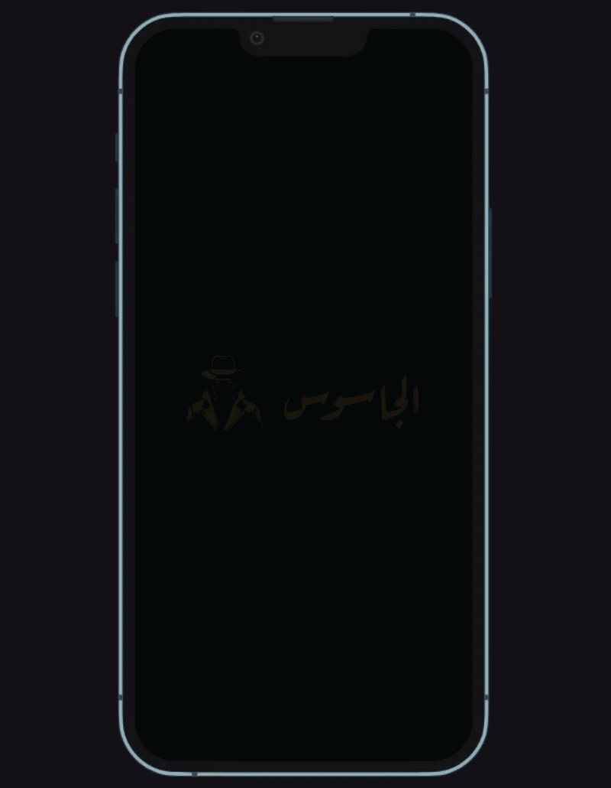

</div>

---

## 🚀 المميزات الرئيسية (Key Features)

<details>
<summary><b>🎨 تجربة مستخدم فريدة</b></summary>
<br>

- **Sketchy UI Design**: هوية بصرية تعتمد على الرسم اليدوي (Hand-drawn) لتجربة مريحة ومميزة.
- **Dynamic Animations**: حركات انسيابية في مراحل التبصيم، التايمر، وظهور النتائج.
- **Micro-interactions**: تفاعلات دقيقة تجعل المستخدم يشعر باستجابة اللعبة لكل لمسة.

</details>

<details>
<summary><b>🕹️ أسلوب اللعب</b></summary>
<br>

- **Group Social Deduction**: لعبة جماعية تعتمد على التواصل المباشر وكشف الجاسوس.
- **Category System**: نظام لتصنيف الكلمات وتوزيع الأدوار بين اللاعبين بشكل عشوائي ومنظم.
- **Multi-Phase Flow**: مراحل لعب منظمة تبدأ من التبصيم وتنتهي بكشف النتائج.

</details>

<details>
<summary><b>⚙️ تحكم كامل في الإعدادات</b></summary>
<br>

- **Game Customization**: إمكانية تعديل وقت الجولة، عدد اللاعبين، وعدد الجواسيس بسهولة.
- **Arabic Interface**: واجهة مستخدم عربية بالكامل مصممة بعناية لتناسب الثقافة المحلية.

</details>

---

## 🛠️ Tech Stack

<hr style="height:1px;border:none;color:#333;background-color:#333;" />

- **Framework**: `Flutter`
- **Architecture**: `Clean Architecture`
- **State Management**: `BLoC / Cubit`
- **Graphics**: `Custom Paint / Flutter Animate`
- **Navigation**: `GoRouter`

---

## 📸 Screenshots

<div align="center">

| | | |
|:---:|:---:|:---:|
|  | 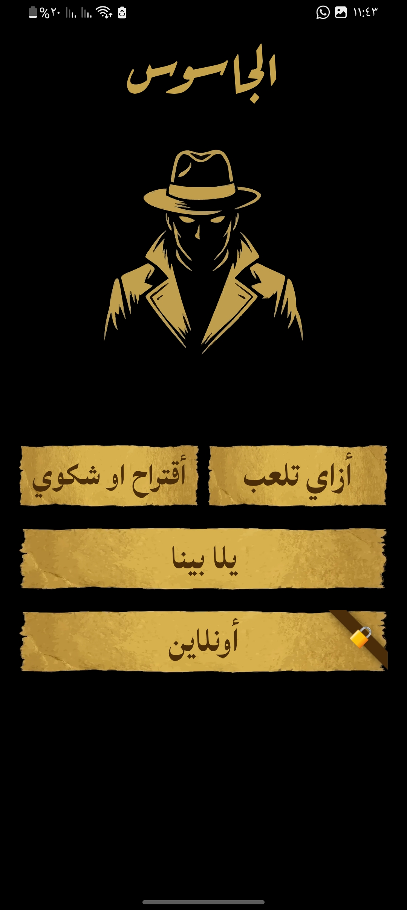 | 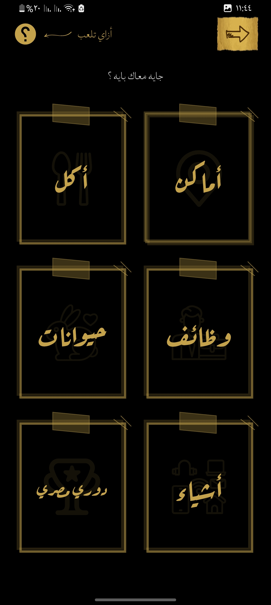 |
| 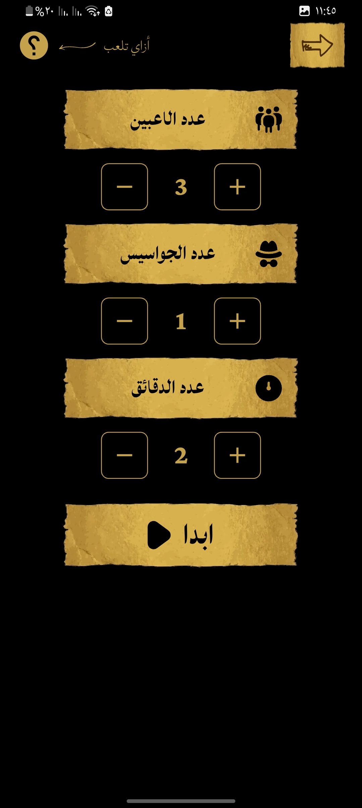 | 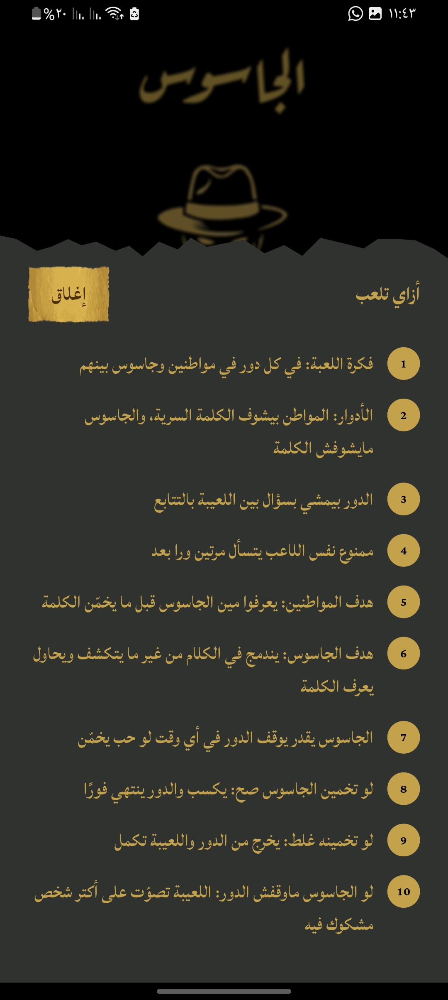 | 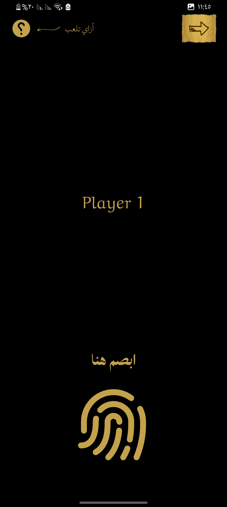 |
| 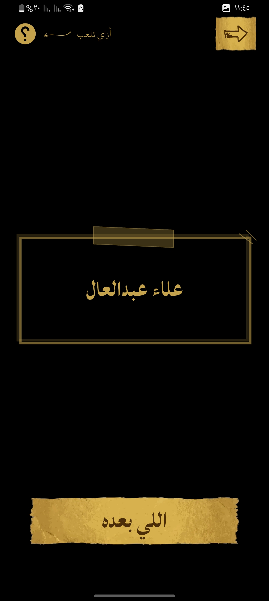 | 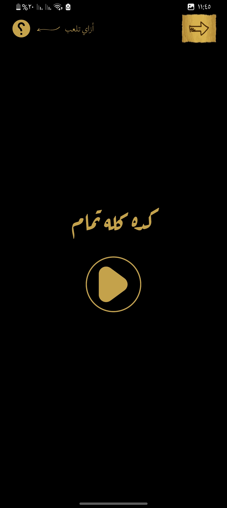 | 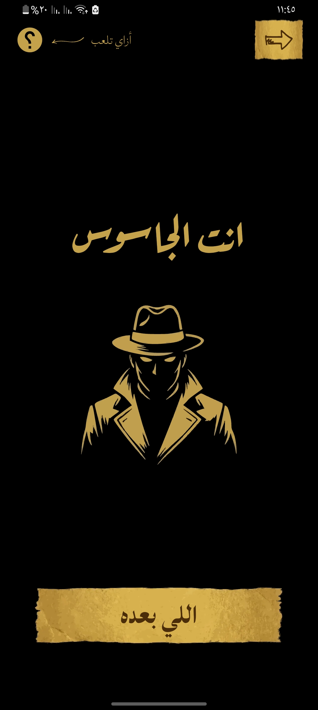 |
| 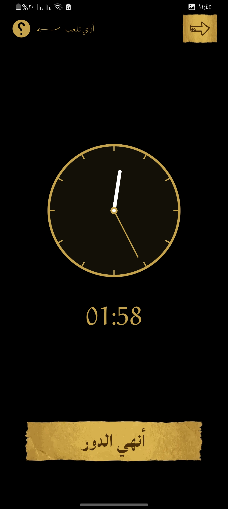 | 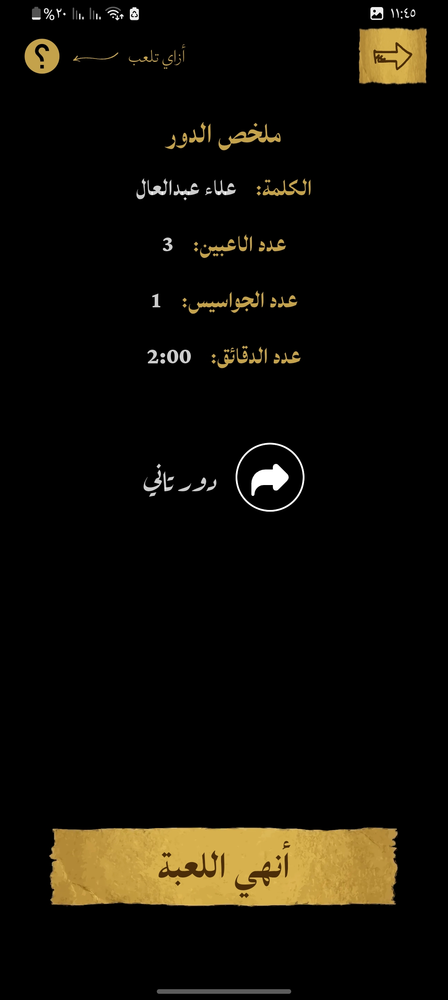 |  |

</div>

---

## 💻 Getting Started

<hr style="height:1px;border:none;color:#333;background-color:#333;" />

1. **Clone the repository**
   ```bash
   git clone https://github.com/Korya0/imposter.git
   ```
2. **Install dependencies**
   ```bash
   flutter pub get
   ```
3. **Run the project**
   ```bash
   flutter run --release
   ```

---

## 📄 License

<hr style="height:1px;border:none;color:#333;background-color:#333;" />

Distributed under the **MIT License**. See `LICENSE` for more information.

---

<div align="center">
Made with ❤️ by Korya
<br/>
<b>© 2026 Imposter Game Team</b>
</div>
